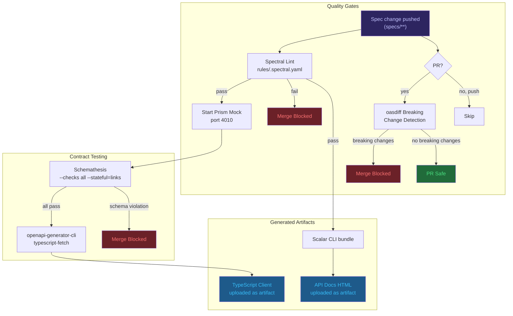

# Diagram: CI Pipeline Flow

> **Usage:** Reference diagram in README. Screenshot for Clip 11 (CI Pipeline) in the video.

```mermaid
flowchart TD
    trigger["Spec change pushed<br/>(specs/**)"] --> lint

    subgraph gates["Quality Gates"]
        lint["Spectral Lint<br/>rules/.spectral.yaml"]
        lint -->|pass| contract
        lint -->|fail| blocked1["Merge Blocked"]

        breaking{"PR?"}
        trigger --> breaking
        breaking -->|yes| oasdiff["oasdiff Breaking<br/>Change Detection"]
        oasdiff -->|breaking changes| blocked2["Merge Blocked"]
        oasdiff -->|no breaking changes| safe["PR Safe"]
        breaking -->|no, push| skip["Skip"]
    end

    subgraph testing["Contract Testing"]
        contract["Start Prism Mock<br/>port 4010"] --> schemathesis["Schemathesis<br/>--checks all --stateful=links"]
        schemathesis -->|all pass| gen
        schemathesis -->|schema violation| blocked3["Merge Blocked"]
    end

    subgraph artifacts["Generated Artifacts"]
        gen["openapi-generator-cli<br/>typescript-fetch"] --> client["TypeScript Client<br/>uploaded as artifact"]
        gen2["Scalar CLI bundle"] --> docs["API Docs HTML<br/>uploaded as artifact"]
    end

    lint -->|pass| gen2

    style blocked1 fill:#6b2128,color:#f87171
    style blocked2 fill:#6b2128,color:#f87171
    style blocked3 fill:#6b2128,color:#f87171
    style safe fill:#216b3a,color:#4ade80
    style client fill:#1e5a8a,color:#38bdf8
    style docs fill:#1e5a8a,color:#38bdf8
    style trigger fill:#2d2560,color:#c4c4ff
```
