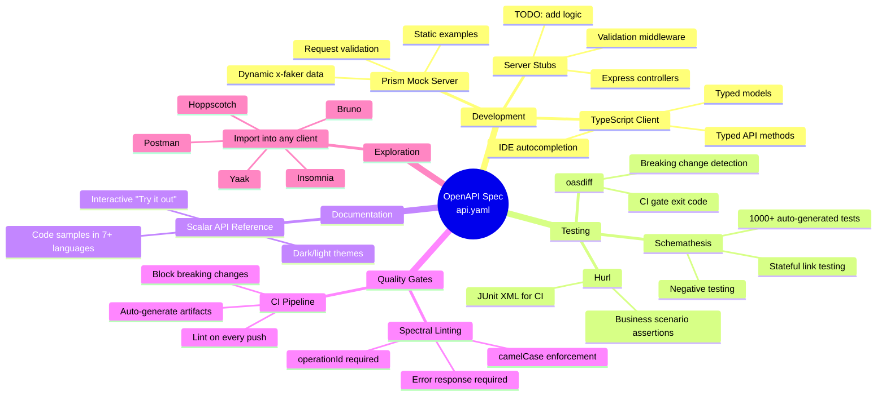

# Diagram: One Spec, Everything Generated

> **Usage:** Slide 3 in the presentation. Screenshot or recreate in your slide tool for best visual impact.

```mermaid
mindmap
  root((OpenAPI Spec<br/>api.yaml))
    Development
      Prism Mock Server
        Static examples
        Dynamic x-faker data
        Request validation
      TypeScript Client
        Typed models
        Typed API methods
        IDE autocompletion
      Server Stubs
        Express controllers
        Validation middleware
        TODO: add logic
    Testing
      Schemathesis
        1000+ auto-generated tests
        Stateful link testing
        Negative testing
      Hurl
        Business scenario assertions
        JUnit XML for CI
      oasdiff
        Breaking change detection
        CI gate exit code
    Documentation
      Scalar API Reference
        Interactive "Try it out"
        Dark/light themes
        Code samples in 7+ languages
    Quality Gates
      Spectral Linting
        camelCase enforcement
        operationId required
        Error response required
      CI Pipeline
        Lint on every push
        Block breaking changes
        Auto-generate artifacts
    Exploration
      Import into any client
        Bruno
        Postman
        Insomnia
        Hoppscotch
        Yaak
```
