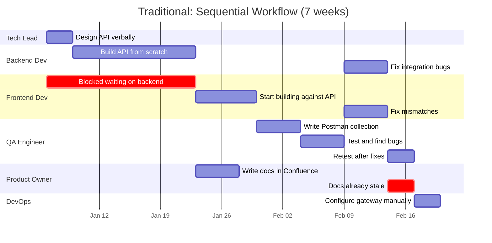
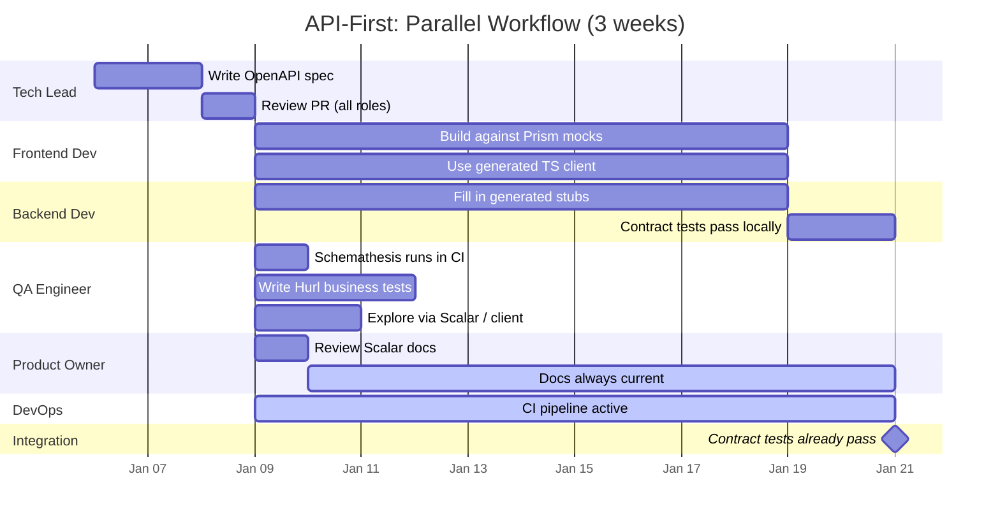

# Diagram: Traditional vs API-First Timeline

> **Usage:** Slide 7 in the presentation. Screenshot or recreate in your slide tool for best visual impact. The two Gantt charts show the same project — traditional (sequential, 7 weeks) vs API-first (parallel, 3 weeks).

## Traditional Approach (Sequential)

## API-First Approach (Parallel)

