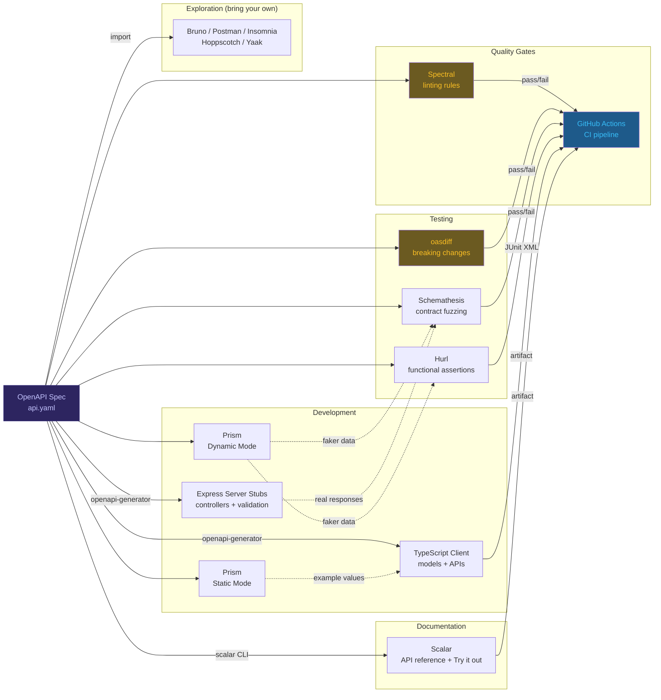

# Diagram: Tool Ecosystem Map

> **Usage:** Reference diagram in README and companion materials. Shows how every tool derives from the OpenAPI spec.

```mermaid
flowchart LR
    spec["OpenAPI Spec<br/>api.yaml"]

    subgraph dev["Development"]
        prism_s["Prism<br/>Static Mode"]
        prism_d["Prism<br/>Dynamic Mode"]
        ts_client["TypeScript Client<br/>models + APIs"]
        server["Express Server Stubs<br/>controllers + validation"]
    end

    subgraph test["Testing"]
        schema["Schemathesis<br/>contract fuzzing"]
        hurl["Hurl<br/>functional assertions"]
        oasdiff["oasdiff<br/>breaking changes"]
    end

    subgraph quality["Quality Gates"]
        spectral["Spectral<br/>linting rules"]
        ci["GitHub Actions<br/>CI pipeline"]
    end

    subgraph docs["Documentation"]
        scalar["Scalar<br/>API reference + Try it out"]
    end

    subgraph explore["Exploration (bring your own)"]
        clients["Bruno / Postman / Insomnia<br/>Hoppscotch / Yaak"]
    end

    spec --> prism_s
    spec --> prism_d
    spec -->|openapi-generator| ts_client
    spec -->|openapi-generator| server
    spec --> schema
    spec --> hurl
    spec --> oasdiff
    spec --> spectral
    spec -->|scalar CLI| scalar
    spec -->|import| clients

    spectral -->|pass/fail| ci
    oasdiff -->|pass/fail| ci
    schema -->|pass/fail| ci
    hurl -->|JUnit XML| ci
    ts_client -->|artifact| ci
    scalar -->|artifact| ci

    prism_s -.->|example values| ts_client
    prism_d -.->|faker data| schema
    prism_d -.->|faker data| hurl
    server -.->|real responses| schema

    style spec fill:#2d2560,color:#c4c4ff,stroke:#3d3580
    style ci fill:#1e5a8a,color:#38bdf8
    style spectral fill:#6b5a21,color:#fbbf24
    style oasdiff fill:#6b5a21,color:#fbbf24
```
